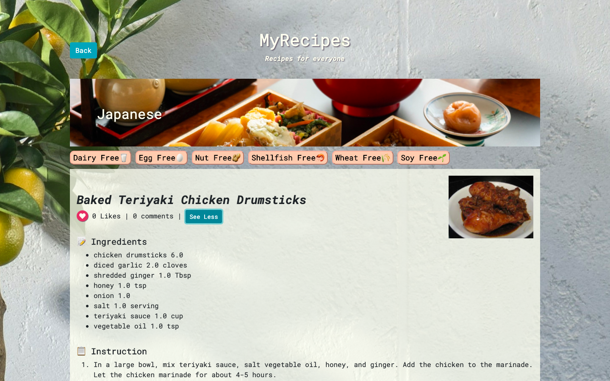

# MyRecipes 🍽

## About
A single page website built with Javascript and Ruby on Rails.

[Link](https://mod3-myrecipes.herokuapp.com/)

Key features:

Users can...
* search recipes by cuisines, and ingredients from 500+ recipes of 16 cuisines
* filter out recipes that contain allergic ingredients from the result
* like recipes
* leave comments

## Technologies and stack

* Frontend: JavaScript, Bootstrap
* Backend: Ruby/Ruby on Rails
* Database: Postgresql
* External API: Spoonacular API(https://spoonacular.com/food-api)
